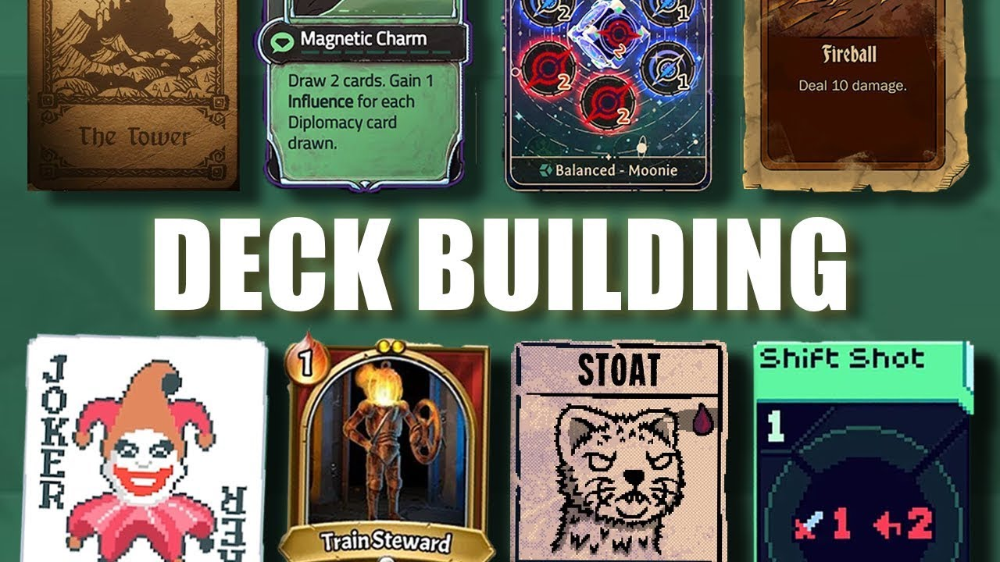
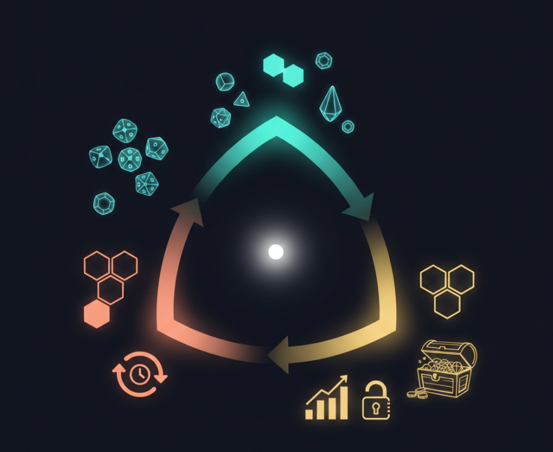
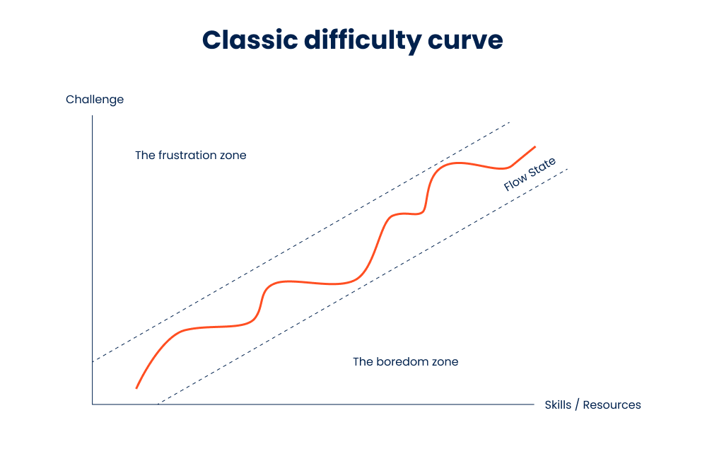
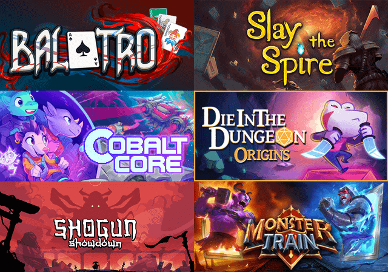

# Everything is a Roguelike

> Roguelike is not a game genre—it is a virus. Whatever genre it infects gains the addiction of "just one more run."

---

*From ASCII symbols to underworld narratives, this grammar has traveled so far that the concept of "genre" can no longer keep up with it.*

---

## I. The Berlin Interpretation Is Dead—and It Died for the Right Reasons

In 2008, a group of Roguelike developers met in Berlin and published a document later worshipped as the "Nine Commandments": random maps, permadeath, turn-based combat, grid-based movement… They attempted to anchor Roguelike permanently to the green terminal screen of *Rogue* (1980).

The problem with this document was not that it was wrong, but that it **asked the wrong question**.

It asked, "What are the features of a Roguelike?" but never asked, "Why do these features make players click 'Restart' at 3 a.m.?" ASCII graphics existed because monitors could only display characters; turn-based combat existed because CPUs lacked processing power; permadeath existed because the player base was so small that the mental cost of starting over was negligible—these were not design choices, but **technological constraints**.

When the technological environment changed and the player demographic shifted, defining a genre by nine fixed factors is like defining transportation by the requirement that it "must have a horse."

> In 2012, Tanya Short wrote *Never Say Roguelike*, arguing that the term had become so blurred it needed to evolve the way "GTA clone" evolved into "open-world game"; Lars Doucet went further, coining the term **Procedural Death Labyrinth (PDL)**, stripping Roguelike down to just three elements: procedural generation, death, and labyrinthine space.
>
> Reference: [Never Say Roguelike](https://www.gamedeveloper.com/business/never-say-roguelike?utm_source=chatgpt.com)

Neither of these solutions addressed the real problem. **Roguelike is not a genre; it is a grammar.**

---

*From Balatro to Hades, the grammar that makes death meaningful has never changed.*

---

## II. Grammatical Diffusion: Roguelike Is Infecting Everything

Roguelike's core mechanics have been extracted from the dungeon and inserted into nearly every genre imaginable. Platformers, deck-builders, MOBAs, even social party games—it is not expanding; it is **infecting**.

| Game | Year | Original Genre Host | Transplanted Roguelike Grammar | Emergent Experience |
|------|------|---------------------|-------------------------------|---------------------|
| *Spelunky* | 2008 / 2012 | Platformer | Procedural levels + permadeath + high-risk exploration | Platformers gain "unpredictability per run" for the first time |
| *Hades* | 2020 | Action ARPG × Character Narrative | Run-loop + death-driven narrative + meta-progression | Death transforms from failure into narrative fuel |
| *Slay the Spire* | 2019 | Deck-building | PCG pathing + run-based construction + irreversible decisions | Card games gain "strategic improvisation" |
| *Vampire Survivors* | 2022 | Hyper-casual × Auto-battler | Random growth + build construction + short-run cycles | Dopamine-compressed loops under minimal input |
| *League of Legends* Hextech / Arena Mode | 2025 | MOBA | In-run random augments + build combinations + temporary construction | MOBAs begin to exhibit "combat high" |
| *Vampire Crawler* | 2026 | Top-down action × Survival exploration | Automated combat + map randomization + meta-build evolution | "Idle satisfaction" fused with exploration pressure |

> **The market signal is already unmistakable.**
>
> Deck-builders have become one of the most reliable indie hit production lines in recent years. *Balatro* sold over 2 million copies in six months; *Slay the Spire* has accumulated more than 6 million units on Steam. More interestingly, even a highly systematized MOBA like *League of Legends* has begun injecting Roguelike grammar into its framework.
>
> Riot introduced the random Hextech Augment system in Arena Mode. Each run randomly assigns builds, randomly alters rules, randomly changes character growth paths—the same champion can manifest completely different playstyles. It is no longer the traditional MOBA formula of "fixed optimal solutions," but rather a short-cycle run.
>
> The truly important implication here is:
>
> Roguelike is ceasing to function as a genre and beginning to function as a **retention architecture**.
>
> It is escaping from indie games and反向 infecting (reverse-infecting) those game systems that originally emphasized stability and competitiveness the most.
>
> Reference: [League of Legends Arena Mode](https://support-leagueoflegends.riotgames.com/hc/en-us/articles/17211075407635-League-of-Legends-Arena-Game-Mode?utm_source=chatgpt.com)

What do these works have in common? None of them attempted to satisfy the nine commandments of the Berlin Interpretation. They simply extracted and recombined the **underlying systemic mechanisms** of Roguelike:

1. **Procedural Generation**—each run provides a different environment
2. **Loop Reset**—each run ends, and progress resets (or partially resets)
3. **Meta-Progression**—even within the reset, something is secretly preserved

These three elements—**Variance, Loop, and Accumulation**—constitute what I understand as the minimal grammar of Roguelike. It is no one's proprietary patent; anyone can use it.

---

## III. The Variance–Loop–Accumulation Triad: The Minimal Complete Grammar of Roguelike

*Variance provides freshness, the loop creates rhythm, and accumulation grants meaning—none of the three can be omitted.*

### 3.1 Procedural Generation: The Art of Uncertainty

Procedural Content Generation (PCG) is not "randomness." Good PCG is **"comprehensible chaos"**—random enough that you cannot predict it, but structured enough that you can learn it.

It operates across three granularities:

| Granularity | Example | Effect |
|-------------|---------|--------|
| **Macro** | *Spelunky* cave layers, *STS* node maps | Spatial dimension of exploration |
| **Meso** | *The Binding of Isaac* item combinations | Strategic adaptation demands |
| **Micro** | Enemy damage variance | Unpredictable challenge |

An important trend: PCG is shifting from **output randomness** to **input randomness**.

**Output randomness** = you make a decision first, then a random event occurs (e.g., a card draw result). **Input randomness** = a random event occurs first, then you make a decision (e.g., Hades' three-choice god boons).

Research indicates that player acceptance of input randomness is significantly higher—because it preserves **agency** and **strategic space**. You are not gambling on probability; you are facing an unpredictable situation and figuring out a response.

> **Triad Imbalance Case Study**
>
> What happens when PCG is too strong and meta-progression too weak? Pure hardcore permadeath games (e.g., *Dwarf Fortress* Adventure Mode) provide the answer: each run varies enormously, but accumulation is nearly zero, resulting in a niche so extreme it borders on cult status. Conversely, what if meta-progression is too strong and PCG too weak? You get *Diablo III*'s endgame gear-driven mode—accumulation feels satisfying, but per-run variance approaches zero, and after a dozen runs you begin to feel like you are clocking in for work.

### 3.2 Loop Reset: From "Death Penalty" to "Cognitive Cadence"

The traditional view treats permadeath as a punishment. This is incorrect.

Loop Reset is a **cognitive cadence regulation device**. It forcibly extracts you from the current context and resets your neural adaptation—any sustained state, no matter how pleasurable, will gradually be normalized by the brain, leading to boredom. Loop Reset interrupts this process.

Reset depth exists on a continuous spectrum:

- **Full Reset** (hardcore): purity of skill mastery, suited for hardcore players
- **Soft Reset** (soft): provides gradual growth through meta-progression, lowering the barrier to entry
- **Micro Reset** (micro): high-frequency feedback loops, suited for fragmented play sessions

Timing structure is equally critical:

- *Slay the Spire* uses "multi-stage accumulation → single reset"—you climb the entire spire, die, and lose everything
- *Hades* uses a three-layer nesting of "room → region → full run"—dying in a room merely costs you one reward, dying in a region merely sends you back to the start, and only dying a full run triggers narrative progression

> **Key Insight**
>
> Loop Reset clears the specific progress of the previous run, but preserves your **procedural knowledge**—you know how Lernie breathes fire, you know which event combinations in *STS* are most dangerous. PCG generates a fresh context after each reset, demanding that you apply accumulated knowledge to unpredictable new conditions. This alternation of "knowledge accumulation → context refresh" makes Roguelike an efficient skill-learning system.

### 3.3 Meta-Progression: Making Every Failure Meaningful

Meta-progression is the third vertex of the triad. It preserves partial accumulation within the rupture of loop reset, maintaining your long-term reward expectation.

Meta-progression divides into four types:

| Type | Example | Motivation Satisfied |
|------|---------|---------------------|
| **Numerical** | Permanent stat upgrades, new character unlocks | "I became stronger" |
| **Knowledge** | Narrative fragment unlocks | "I learned something" |
| **Social** | Leaderboards, achievements | "Others know I became stronger" |
| **Aesthetic** | Skins, room decorations | "This is mine" |

Why can't players stop playing *Hades*? Because it provides all four: Mirror of Night upgrades (numerical), character relationships and plot (knowledge), weapon appearances and room decorations (aesthetic), plus an achievement system (social).

Accumulation rate design should follow **diminishing marginal returns**: rapid early unlocks, gradual mid-game tuning, and late-game focus on aesthetics and social elements—because by then the player's "power growth" motivation has already been satisfied.

---

## IV. Interrupted Flow: Why Roguelike Is Impossible to Put Down

*Immersion is not about never being interrupted; it is about craving to restart after the interruption.*

### 4.1 The Trap of Sustained Flow

Csikszentmihalyi's flow theory has been cited so many times in game design circles that it has become a cliché. But one problem has rarely been properly addressed: **sustained flow is not only difficult to maintain; it makes you sleepy.**

Not literally sleepy, but your brain habituates to the rhythm and begins to wander. Any sustained pleasure, over time, becomes dull.

This is why three hours of *The Witcher 3* can produce a subtle sense of fatigue, while three hours of Roguelike leaves you increasingly energized.

The original model of classical flow theory mentions "exit" and "reflection" phases, but treats them as natural terminations of flow. The core experiential feature of Roguelike is: players do not pursue the longest possible continuous immersion, but rather sustain engagement through repeated cycles of **"immersion → interruption → re-immersion."**

### 4.2 Interrupted Flow: The Alternation of Rupture and Novelty Reset

I call this **Interrupted Flow**.

**Cognitive rupture** serves as the initiating mechanism. Loop reset forcibly extracts the player from the current context, performing multiple functions at the neurocognitive level:
- Interrupts the automated execution of the current cognitive schema
- Forces the brain to shift from "model-driven" to "data-driven" processing
- Creates a reflection window to review experience and evaluate strategy
- Introduces emotional contrast effects, enhancing motivation upon re-engagement in the next cycle

**Novelty reset** serves as the reactivation mechanism. After cognitive rupture creates a "cognitive zeroing" state, the fresh stimuli generated by PCG reactivate exploratory motivation.

The effectiveness of novelty reset depends on PCG's **perceived diversity**—the degree of per-run difference subjectively felt by the player. It is not about how objectively different each run is, but about **whether you feel** this run is different from the last.

### 4.3 Variable Ratio Reinforcement: The Ghost of the Skinner Box

The motivational maintenance mechanism of interrupted flow can be explained through B.F. Skinner's operant conditioning theory. Skinner distinguished four reinforcement schedules, among which the **Variable Ratio Schedule**—in which reinforcement is delivered after an unpredictable number of responses—has been proven to produce the highest and most stable response rate.

The triad model of Roguelike structurally maps precisely onto this mechanism:

| Reinforcement Schedule Element | Roguelike Equivalent |
|-------------------------------|----------------------|
| **Behavioral response** | Each game loop / run |
| **Reinforcer** | Rare items, first boss kill, narrative unlock |
| **Ratio control** | PCG ensures unpredictability of reinforcer delivery |
| **Behavioral maintenance** | The expectation that "the next one might be better" |

> **Ethical Clarification**
>
> The critical difference between Roguelike and gambling lies in expected value binding. Gambling's variable ratio reinforcement is typically bound to negative expected value (you will inevitably lose in the long run), whereas a well-designed Roguelike ensures **positive long-term expected value** through its meta-progression system—each loop contributes to skill improvement and content unlocks, and failure itself produces positive returns in knowledge accumulation. You continue not because you "might win," but because **"even if I lose, I gained something."**

---

## V. Everything Is a Roguelike: A Brief Discussion

*SLG battlefields change; RPG skill combinations change. Only the underlying grammar of "randomness–reset–growth" remains constant.*

### 5.1 Already Demonstrated

#### ▎Action Shooter: The Duet of Construction and Execution

***The Binding of Isaac*** (2011) pioneered the classic mode of deep coupling between item construction and real-time execution. The pairwise combinations of hundreds of items generate near-infinite strategic space. "Technology X" replaces tear attacks with penetrating laser beams; the "Flight" item eliminates terrain constraints—this **emergent complexity** is PCG at its finest at the meso-granularity.

***Vampire Survivors*** (2022) took the opposite extreme: the execution layer is compressed to a single movement input, while the item construction system carries nearly all strategic depth. This minimalist design drastically lowers the execution barrier while retaining the exponential growth effect of item stacking for depth-seeking players.

| Dimension | *The Binding of Isaac* | *Vampire Survivors* |
|-----------|------------------------|---------------------|
| Execution complexity | High (twin-stick shooting + active items) | Minimal (movement only) |
| Construction depth | Extreme (700+ item synergies) | High (weapon evolution trees) |
| Run duration | 30–60 minutes | 15–30 minutes |
| Core innovation | Emergent complexity of item synergies | Pure construction optimization under auto-attack |

#### ▎Card Games: Infinite Strategy Within Finite Options

***Slay the Spire*** (2019)'s core innovation lies in "strategic optimization within limited options": randomly drawing subsets from a vast card pool to form selectable decks, then gradually building the deck through combat rewards, shop purchases, and event choices.

Its PCG design pattern can be summarized as **"visible structure + random fill"**—players can preview the overall map structure (constraint), but specific nodes are randomly generated (variance). This pattern can be directly copied by virtually any genre seeking Roguelike transformation.

#### ▎MOBA and Auto-Battlers: Randomness Injection Within Competitive Frameworks

***League of Legends* "Hextech Mayhem"** implants "per-run random augmentation" into a highly structured competitive framework. Traditional MOBAs emphasize predictability; the injection of Roguelike elements introduces strategic unpredictability into competitive determinism.

**Auto-battlers** can be viewed as an extreme development of this logic: each round's shop refresh is essentially PCG-driven public resource management, and the "economy management → roster construction → positioning adjustment" cycle is structurally isomorphic to Roguelike's "resource acquisition → combination optimization → effect validation" structure.

### 5.2 Bold Speculations

#### ▎SLG: "One Run, One World"

The core pain point of current SLGs (simulation/strategy games) is that campaign content is consumed far faster than it can be produced.

Roguelike-ification proposal:
- **PCG random campaign maps**: terrain generated by algorithm according to typological rules, creating unique geostrategic configurations each run
- **Run-independent tech pools**: each run randomly draws available technologies from the total tech pool, shifting strategic space from "finding the optimal solution" to "finding a satisfactory solution under constraints"
- **"Tactical Legacy" meta-progression**: after a commander dies, retained formation memories and tactical experience persist

Combined, SLGs can achieve a **"One Run, One World"** strategic Roguelike form.

#### ▎RPG: Procedural Quest Structures

The core lies in **procedural quest structures**: key narrative nodes remain fixed (ensuring story coherence), while connecting sidequest chains and encounter events are dynamically generated by PCG based on the player's current state.

I propose a mechanism called the **Build Core**: at the start of each run, a core mechanical direction is randomly selected from a pool (e.g., "crit bleed," "shield thorns," "summon control"), and all available skills, equipment, and companions are generated with bias toward the selected Build Core. Different Build Cores correspond to different character identities and story paths, allowing mechanics and role-playing to mutually support each other at a deep structural level.

Meta-progression should leverage the narrative strengths of RPGs: worldview cognition (multi-run gradual revelation of the complete picture) and NPC relationship memory (cross-run character interaction accumulation), creating genuine **"role-playing"** depth.

#### ▎Simulation/Management: PCG-Driven Economic Cycles

The core lies in shifting the economic system from **script-driven to PCG-driven**: base economic parameters are randomly initialized, periodic fluctuations carry random characteristics, and random shock events occur at random timings and intensities.

Introduce **causally linked "random event chains"**—supply chain rupture → raw material price surge → player chooses response strategy → divergent branch endings—extending Roguelike unpredictability from the spatial dimension to the temporal dimension.

Meta-progression adopts a **"Second Startup"** framework: when a business fails, retained "brand reputation residual value" and "supply chain knowledge" serve as starting resources for the next run, transforming failure from "game over" into a heroic narrative of "rising from the ashes."

#### ▎Sports/Racing: Generated Rule Variants

The core innovation lies in PCG-generated **"rule variants"**: each new season automatically generates unique race conditions—track effects, weather conditions, special rule adjustments. The key design principle is **"symmetric variants"**—all participants face the same rules; the variant changes the optimal strategy, not the fundamental capability.

Driver/vehicle trait combinations adopt a "per-season random trait pool" design, forcing players to abandon fixed optimal-configuration thinking and转向 flexible adaptive strategies. Meta-progression focuses on **"organizational knowledge"** accumulation across seasons—training methodologies and team chemistry carry path-dependent characteristics.

#### ▎Social/Party: Mechanic Variants and Scenario Scripts

The core goal is to reduce repetition and enhance social freshness. Daily random **"mechanic variants"**—rotating mission types, rule micro-adjustments, special events triggered at random.

The deeper innovation lies in PCG-generated **"Social Scenario Scripts"**: each run defines a temporary relational structure among players—cooperation demands, competitive relationships, information asymmetry, trust mechanisms. This extends Roguelike's core of "adaptive decision-making" from individual strategy to the social game theory level, creating a unique **"interpersonal Roguelike"** experience.

---

## VI. The AIGC Era: From Procedurally Generated Levels to Procedurally Generated Meaning

*When AI can generate not only levels but meaning, every loop will possess a story that belongs only to you.*

### 6.1 From PCG to PMG: A Triple Leap

Current PCG is largely confined to the spatial layer (levels, maps) and the numerical layer (item attributes, enemy parameters). With the development of LLMs, Roguelike is undergoing a leap from **Procedural Content Generation (PCG) to Procedural Meaning Generation (PMG)**:

**First, LLM as Dynamic Narrative Engine.**
Generating personalized narratives in real-time based on player decisions—not selecting from pre-authored branches, but creating unique narrative responses based on contextual understanding of player behavior; maintaining narrative coherence across runs, making multiple playthroughs constitute an organic narrative whole.

**Second, Adaptive Difficulty Regulator.**
LLMs can identify player skill levels and preference styles, predict frustration or boredom risks, and generate "just-right" challenges. They can adjust multiple PCG parameters: item synergy probability, enemy configuration intensity curves, event content emotional tone—this is true **"experience adaptation"** rather than simple "difficulty adaptation."

**Third, Emergent Quest Generator.**
Real-time generation of side objectives highly relevant to the current game context, including narrative motivation, multiple solution paths, and potential interactions with other systems. This extends Roguelike's "systemic emergence" from the mechanical layer to the narrative layer, achieving true **"player-driven narrative."**

### 6.2 Key Design Principle: Constrained Emergence

PMG implementation must confront a fundamental tension: LLM generative capacity far exceeds traditional PCG, potentially creating hyper-complex systems that human designers cannot foresee and players cannot learn—thereby dissolving the **"comprehensible chaos"** upon which Roguelike's core fun depends.

**"Constrained Emergence"** is the key design principle for the AIGC era, relying on a dual-layer control mechanism:

| Control Layer | Function | Implementation |
|--------------|----------|----------------|
| **Typological Rule Embedding (System Layer)** | Delimiting the boundaries and structure of the generative space | Embedding genre-specific rule libraries; defining "hard boundaries" (absolute constraints) and "soft guidance" (preference directions) |
| **Player Modeling (Personalization Layer)** | Dynamically adjusting personalized parameters | Establishing skill profiles, preference profiles, and emotional state models; ensuring content remains within the player's **"zone of proximal development"** |

> **Disclaimer**: PMG remains at the conceptual verification stage and represents the author's speculative vision. Active discussion is warmly welcomed.

---

## Conclusion: Fingers at 3 A.M.

"Everything is a Roguelike" is not market hype. It describes a structural shift in game design from **"handcrafted narrative" to "systemic emergent narrative."**

The deep drivers of this shift are simple:
- As game scales expand, the cost-benefit ratio of handcrafted content production diminishes
- Player demand for replayability has surpassed single-consumption narrative experiences
- In the era of live streaming and social media, "shareable unique experiences" have become core product value
- AIGC technology enables system-generated content quality to approach handcrafted content

Roguelike's **Variance–Loop–Accumulation** triad precisely addresses these demands: PCG provides infinite content diversity, Loop Reset creates a sustainable consumption cadence, and meta-progression maintains long-term user relationships.

This is not a new trend. Game design has long been shifting from "the author decides" toward "the system runs itself." The Berlin Interpretation attempted to lock Roguelike in 1980, but once a grammar is born, it finds its own hosts.

**3 a.m. You died. The screen goes dark.**

Three seconds later, your finger has already pressed restart.

Not because you are unwilling to accept defeat, but because the system knows—variance is waiting for you, accumulation is waiting for you, and you, too, are waiting for that next run that belongs only to you.

---

## References

1. International Roguelike Development Conference. (2008).
   *The Berlin Interpretation*.
   RogueBasin.
   http://www.roguebasin.com/index.php/Berlin_Interpretation

2. Boucher, J. D., Telliel, Y. D., & Smith, G. (2025).
   *Shifting Genres: Limits of Video Game Genre Taxonomy in Roguelikes*.
   In *Proceedings of the 20th International Conference on the Foundations of Digital Games (FDG 2025)*.
   ACM.

3. Csikszentmihalyi, M. (1990).
   *Flow: The Psychology of Optimal Experience*.
   New York: Harper & Row.

4. Skinner, B. F. (1969).
   *Contingencies of Reinforcement: A Theoretical Analysis*.
   New York: Appleton-Century-Crofts.

5. Cook, D. (2007).
   *The Chemistry of Game Design*.
   Gamasutra.
   https://www.gamedeveloper.com/design/the-chemistry-of-game-design

6. Uygurcetin, C. (2025/2026).
   *Emergent Storytelling in Roguelike Games: From Digital Systems to Physical Play*.
   Bachelor's Thesis, Politecnico di Torino.

7. Lemoine, B., Laforcade, P., & George, S. (2024).
   *Designing Declarative Knowledge Training Games: An Analysis Framework Based on the Roguelite Genre*.
   In *Computer Supported Education*.
   Communications in Computer and Information Science (CCIS).
   Springer.

## License

[MIT](./LICENSE)
